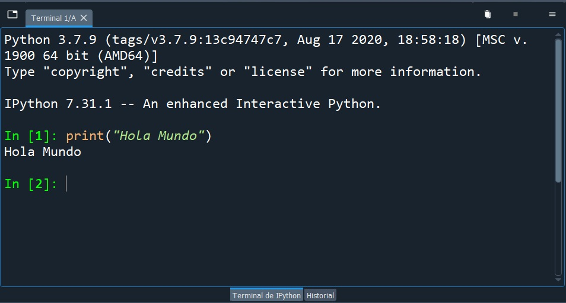
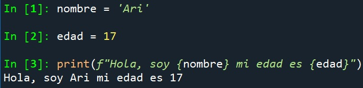
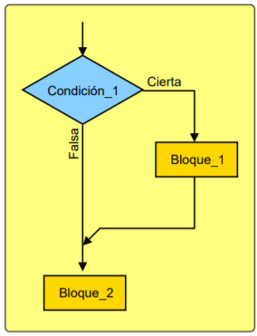
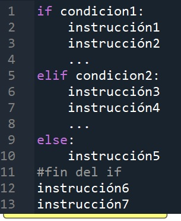
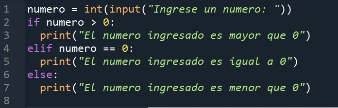
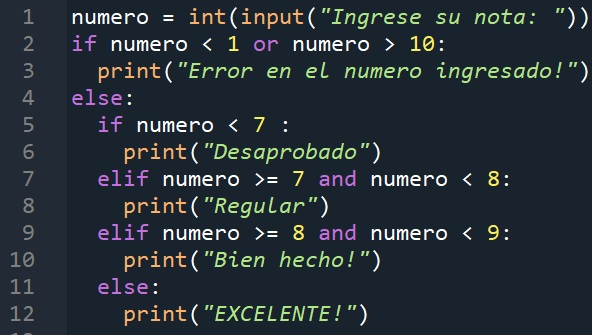
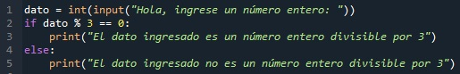

# Programa Básico de Python:

## Nombres y extensión de los archivos:
    Es recomendado que los nombres de los archivos de programa de Python sean:
    ● Escritos en minúscula
    ● No contengan espacio, usar guiones bajos para separar palabras
    ● Ser ordenados y que el nombre del archivo sea representativo de su
    contenido y entendible.
    ✔ Por número de ejercicio: 
        ejercicio_1.py
        ejercicio_2.py
        ej1.py
        ej2.py, etc.
    ✔ Por nombre de enunciado: 
        max_lista.py
        valor_medio.py
        calculadora.py
    ✔ Por nombre estación_enunciado: 
        E1_valor_max.py
        E2_listas.py
        E3_calculadora.py


## Nombre de las variables
    Las variables son utilizadas para almacenar información, cada variable tendrá guardada en su
    interior un dato numérico o una palabra. Para crear una variable hay que darle un nombre.
    Los nombres de las variables tienen que ser simples, representativos y sin espacios, se usa “_” 
    (guión bajo) para reemplazar los espacios, que no están permitidos. Por ejemplo para una
    variable que contenga cantidad de vinos producidos le podemos llamar: cantidad_vinos, no es
    una buena práctica colocarle nombres que no se entiendan como c_v, cant_v, c_vinos, vinos la
    idea es elegir un nombre que al leerlo automáticamente el programador se dé cuenta de que
    variable se está hablando y qué función cumple dentro del código. Spyder cuenta con una
    función que auto-completa los nombres de funciones y variable medida que comenzamos a 
    escribirlas, por ello podemos colocar nombres largos sin pensar que luego nos costará mucho
    repetirlos cada vez que los utilicemos, será suficiente clickear en la propuesta del programa
    que corresponda a la variable que necesitemos.

# Actividad E2:
De manera oral, repasar cuáles serían las alternativas más correctas y los conceptos
iniciales:
## Actividad 1:
1. ¿El nombre correcto para una variable que guarde los nombres de todos los municipios
de Mendoza debería llamarse?:
    a. municipios mendoza
    b. municipios_mendoza
    c. m_mdz
    ==> Respuesta:

## Actividad 2:
2. Se desea crear una variable en la que se guarde la cantidad de alumnos de un curso,
ésta debería llamarse:
    a. alumnos
    b. alm
    c. a_l_m
    ==> Respuesta:
## Actividad 3:
3. En la variable casas_del_barrio se desea guardar el valor de 33, lo correcto sería
escribir:
    a. 33 = casas_del_barrio   
    b. casas_del_barrio = 33
    c. c_d_b = 33
    ==> Respuesta:
## Actividad 4:
4. ¿Para qué se usan las variables?
    Las variables en los lenguajes de programación se utilizan para almacenar y manipular datos. Son contenedores que pueden contener valores de diferentes tipos, como números, texto, booleanos, objetos, etc. Las variables permiten a los programadores almacenar datos en la memoria de la computadora y acceder a ellos más tarde durante la ejecución del programa.
    
    Aquí hay algunas razones clave por las que se utilizan las variables en los lenguajes de programación:
    ### Almacenamiento de datos: 
    Las variables permiten almacenar datos en la memoria de la computadora durante la ejecución del programa. Esto es útil para recordar valores y utilizarlos más adelante en el código.

    ### Manipulación de datos: 
    Las variables pueden utilizarse para realizar operaciones y manipulaciones en los datos almacenados. Puedes realizar cálculos matemáticos, concatenar cadenas de texto, modificar valores booleanos, entre otras operaciones.

    ### Facilitan la legibilidad y mantenimiento del código: 
    Al utilizar variables, puedes asignar nombres significativos a los datos almacenados, lo que hace que el código sea más legible y comprensible. Esto facilita el mantenimiento del código en el futuro, ya que es más fácil entender y modificar el código cuando se utilizan variables con nombres descriptivos.

    ### Permiten la reutilización de código: 
    Almacenar datos en variables facilita la reutilización de código. Puedes utilizar los mismos datos en diferentes partes del programa simplemente haciendo referencia a la variable correspondiente en lugar de escribir los datos repetidamente.

    ### Interacción con el usuario: 
    Las variables también se utilizan para interactuar con el usuario. Pueden almacenar los valores ingresados por el usuario a través de la entrada estándar y utilizar esos valores en el programa.

# Actividad 5:
5. Completar lo que falta para que el nombre de la variable sea correcto:
    a. jugadores equipo azul ==> Respuesta:
    b. fin juego ==> Respuesta: 
    c. costo total ==> Respuesta: 

# Actividad 6 - complementaria (opcional)
6. ¿Cuál es el error en el nombre de la siguiente variable: mensajes recibidos?
==> Respuesta: 

# Asignación de valores
Para poder guardar un dato dentro de la variable hay que saber utilizar el símbolo de asignación “=” igual.

    ciudad = “Mendoza”
    marca_celular = “Huawei”
    edad_promedio = 16
    profundidad_metros = -100

En la variable ciudad se guarda una sucesión de letras que forman la palabra “Mendoza”. En la
variable marca_celular se guarda “Huawei”. En edad_promedio se guarda 16 haciendo
referencia a que la edad promedio de un curso es de 16 años. En profundidad_metros
guardamos un número negativo -100.
El operador = debe colocarse de tal forma que indiquemos: nombre_de_la_variable = “valor
guardado".
Las palabras se guardan entre comillas dobles “”. o comillas simples ‘‘. Las frases también se
guardan entre comillas y obviamente pueden contener espacios.
Los números se guardan sin comillas cuando necesitamos operar matemáticamente con ellos, y
entre comillas cuando los usamos como texto sin valor numérico.

## Actividad 7:
7. Realizar el código correspondiente si se desea guardar “Hola Mendoza Futura” en la variable saludo.
==> Respuesta:

## Actividad 8:
8. Las palabras se guardan entre comillas, realizar el código para guardar la palabra “rosa” en la variable color_elegido.
==> Respuesta:

## Actividad 9:
9. Crear una variable que guarde la cantidad de autos que hay en un estacionamiento
siendo que actualmente hay 22 autos en él.
==> Respuesta:

# Consola o terminal
Recordemos que cada renglón de un programa de Python puede contener como máximo una instrucción. Estas instrucciones 
se ejecutan de arriba hacia abajo, de forma ordenada y secuencial. El orden importa porque la computadora ejecutará las instrucciones línea por línea desde el inicio (arriba) hasta el fin del código.
La Terminal o Consola de Python es el lugar donde se observan los resultados de un programa convencional de Python, también se lo conoce como intérprete de Python.
Para imprimir -mostrar- un mensaje o resultado por consola se utiliza la función print().



## Actividad 10:
10. Se desea imprimir:
“En Mendoza Futura aprendemos:
Python”

Respuesta: 


# Salida Fija o Salida Variable
Para imprimir un mensaje fijo (no contenido en una variable de texto) lo colocamos entre “comillas_dobles” o ‘comillas_simples’.

    ciudad = “Mendoza”
    print(ciudad)
    Salida: “Mendoza”

    ciudad = “Mendoza”
    print(“ciudad”)
    Salida: “ciudad”

    saludo= “Hola Mundo”
    print(saludo)
    Salida: “Hola Mundo”

    print(“Hola Mundo”)
    Salida: “Hola Mundo”

Si se desea imprimir lo que hay guardado dentro de una variable se hace:

variable = ”contenido”
print(variable)

Si se coloca el nombre de una variable dentro del print() el resultado será lo que hay guardado
dentro de esa variable, en cambio todo lo colocado entre “” será impreso como un mensaje, sin importar que escribamos contenido entre las comillas.


## Actividad 11:
11. Se desea imprimir el nombre guardado en la variable nombre, completar:

nombre = “Batman”
print( )
#Salida (resultado) : “Batman”

## Actividad 12:
12. ¿Qué es la consola?

a. El área donde se muestran los resultados o salidas de los programas.
b. El área donde escribimos el código
c. El área donde escribimos el mensaje

## Actividad 13:
13. ¿Qué hace print()?

a. Crea una variable
b. Muestra el valor de una variable

## Actividad 14:
14. ¿Cuál será el resultado?

mes = “Abril”
print(“mes”)
Salida: ................

# ENTRADAS Y SALIDAS ESTÁNDAR:
Sentencia print()
La sentencia u orden print() evalúa la expresión que colocamos entre paréntesis,
devuelve y escribe el resultado en la consola de comandos: print(“ejemplo”). Imprime o muestra
mensajes en la pantalla de nuestro ordenador. Es una salida, no se guarda, sino que se muestra
o expone.
Con el comando f”” el programador es capaz de mostrar el valor guardado dentro de la
variable, es otra forma ordenada de imprimir mensajes, donde utilizamos menos comas, ya
que las variables son llamadas dentro de las llaves {}.



## Actividad 15:
15. ¿Qué hace print()? Realizar el ejemplo de la imagen anterior en el intérprete de Python con tu
nombre y edad. Observar y analizar el explorador de variables. 

Para usar la sentencia print() se debe tener en claro cuál será el mensaje a imprimir y
cuáles serán las variables involucradas en ese mensaje. En el ejemplo anterior se imprimen 3
cadenas de caracteres distintas intercaladas con dos variables. En el primer Episodio vimos que
los elementos que se quieren imprimir como caracteres van entre comillas simples ‘‘ o dobles “
” (es indiferente). Si se quiere mostrar el valor de una variable en el mensaje hay que colocar
entre comas (,) el nombre de la variable. O bien se puede aplicar la estructura que se muestra
en la siguiente línea:

```sh
print(f”cadena de texto {variable} cadena de texto {variable} cadena de texto”)
```

Es importante saber y recalcar que todo lo que se encuentre entre comillas simples o dobles va
a imprimirse como mensaje, es decir que si colocamos el nombre de una variable dentro de
estas comillas y no hay que esperar que se imprima en pantalla el valor de la variable, se
imprimirá el nombre de la variable como texto.

## Actividad 16:
16. En el intérprete Python, darle un valor a n1 y ejecutar (de a una) las
siguientes líneas de código
```sh
print(“mensaje”,n1)

print(“mensaje”,n1,”mensaje”)

print(“mensaje \n”)

print(“mensaje \n\n”)

print(“\n\nmensaje\n\n”)

print(“\n|\n|> mensaje\n|\n”)
```

“\n” es un carácter especial, es “nueva línea” que es la tecla que en los procesadores de texto
conocemos como “Enter”.
Print tiene por defecto un salto de línea (\n) al final de su mensaje. Observar ejemplo:

```sh
1. print('Hola Mendoza')
2. print('Futura')
```
Salida: 

```sh
Hola Mendoza
Futura
```

Este carácter de finalización puede cambiarse por otros, hay que agregar otro argumento
llamado end=”caracter_de_separación”. Print viene por defecto con end = “\n” pero puede
cambiarse. Observar:

```sh
1. print('Hola Mendoza', end=" ")
2. print('Futura')
```
Salida: 
```sh
Hola Mendoza Futura
```
o 
```sh
1. print('Hola Mendoza', end="@")
2. print('Futura')
```

```sh
Hola Mendoza@Futura
```
Realizar ejemplos anteriores y experimentar con distintos símbolos para el
parámetro end= “”.

# Tipos de Variables Básicas
## De texto y numéricas:
Como ya se introdujo en los ejemplos anteriores, existen diferentes tipos de variables, según lo que se busque guardar en ellas, podemos clasificar las básicas en 3 tipos:

    ● Variables numéricas enteras (números sin coma)
    ● Variables numéricas con coma (números con coma)
    ● Variables para texto (palabras o frases)

Para guardar un número dentro de una variable no se colocan las comillas.
manzanas = 5
En el caso de colocar las comillas: manzana = “5”, el valor dentro de manzana no será reconocido como un número, ese 5 es tomado como una palabra, es decir que no podemos sumarlo, restarlo, multiplicarlo ni dividirlo, es un texto. Si se guarda sin comillas, es un número.

Los números pueden:

multiplicarse con el símbolo *
dividirse con /
sumar con +
restar con -

¿Qué se guarda dentro de numero si: numero = 2*5? Respuesta: 10.
Observar los siguientes ejemplos:

numero_1 = 5
numero_2 = 7
print(numero_1+numero_2)
resultado: 12
print(numero_1*numero_2)
resultado: 35
temperatura = 20.5 + 5
print(temperatura)
Salida: 25.5

En este ejemplo observamos que se utiliza el sistema de puntuación donde el punto representa la coma decimal de nuestro sistema.
# Actividad 18:
18. Completar la salida:
```sh
N1 = “5”

N2 = “21”

print(N1+N2)
```
Salida: ...

¿A qué se debe este resultado? ¿Por qué no es 26? Modificar
el código anterior para que la salida de print(N1+N2) sea 26 y no 521.

Si se suman dos variables que guardan texto el resultado será las dos palabras impresas una al lado de la otra, no importa el valor que contengan, la suma de variables del tipo STR (cadena de texto) no dependen de su valor (no se suma numéricamente su valor por ser texto), si se tienen variables entre comillas “” ‘‘ se toman como texto sin importar que se coloque adentro, es decir que los números y operadores matemáticos serán interpretados como texto y pierden su valor numérico y matemático, ejemplo: print(“3*5”) da como resultado en la consola: 3*5 y no 15. De otro modo print(3*5) devuelve 15.

# Actividad 19:
19. Multiplicar las variables base y altura y mostrar por consola la superficie de
un rectángulo
```sh
base = 5

altura = 4

print(base*altura)
```
Respuesta: 

## Variables verdaderas o falsas
Existen variables que solo pueden guardar dos valores, True y False. En Python el verdadero es True y falso es False, sin paréntesis, es importante recordar colocar las mayúsculas ya que true y false no existen, pero sí True y False.
Algo es verdadero (True) cuando existe, es distinto a cero, está disponible, cumple una condición, es correcto, está bien, encendido o es accesible.

False es lo opuesto de True.

Algo es falso (False) cuando no existe, es cero, está vacío, no puede realizarse, no está disponible, no cumple con la condición, está apagado o no es correcto.
El True y False pueden asignarse igual que se hace con las otras variables ya estudiadas:
```sh
encendido = True

print(encendido)
```
Salida: True


Lo interesante de estas variables es que podemos indicar si algo está encendido o apagado, disponible o no disponible, si existe o no existe, si hay o no hay, si es igual o distinto a cierto valor (comparar), si es correcto o incorrecto, etc.
Los valores True y False no son texto, no van entre comillas “”.
Si se desea expresar que un motor está encendido se hace: motor = True y en el caso de estar apagado, motor = False.
True y “True” son distintos, uno es una variable que indica que existe la presencia de algo y el otro es un texto porque está entre comillas “”.

## Actividad 20:
20. Crear una variable llamada estado y guardarle un True.

## Actividad 21:
21. Crear una variable llamada alarma y hacer lo necesario para decir que la alarma está desactivada.

Negador:

Existe otra variable del tipo booleana (True y False) que niega el estado de una
variable, si la variable es un True, al negarla se hace False. Si la variable es False, al negarla se hace True.
Básicamente la negación devuelve el valor opuesto de una variable del tipo True o False. Esta variable se llama not y se coloca delante de la variable que se desea negar.
```sh
not True = False

not False = True
```
Observar que no puede colocarse solo not, por ejemplo: avanzar = not está mal ya que no está negando nada, se debe colocar luego del not la variable que se desea negar.

```sh
encendido = True

apagado = not encendido
```


## Actividad 23:
22. En el intérprete de Python colocar algunos de los siguientes códigos y
expresar resultados:
```sh
Código (entrada)  Respuesta (salida)

print(not True)

print(not False)

encendido=True

apagado = not encendido

print(encendido)

print(apagado)

encendido = True

print(not encendido)

resultado = 3 != 5

print(resultado)
```
## Actividad 23: 
23. ¿Qué hace el operador not?

## Actividad 24:
24. ¿Por qué colocamos not delante de las variables y no detrás? ¿Hay algún símbolo matemático con el que lo puedas relacionar?

En programación, el operador lógico "not" se coloca delante de las variables o expresiones para negar su valor. Esta convención se debe a la influencia de la notación matemática y lógica en los lenguajes de programación.

En matemáticas y lógica, la negación se representa con el símbolo "~" o con una barra horizontal encima de la variable o expresión. Sin embargo, en la mayoría de los lenguajes de programación, se adoptó la notación "not" como una palabra clave o un operador para negar valores booleanos.

La razón principal de colocar "not" delante de las variables en lugar de detrás es principalmente una cuestión de legibilidad y claridad del código. Al colocar "not" delante de una variable o expresión, se resalta de manera más clara la negación y es más fácil de entender para los programadores.

Además, colocar "not" delante de una variable sigue la convención general de lectura y escritura en muchos lenguajes de programación, donde el operador se coloca antes de los operandos. Esto se aplica a otros operadores lógicos y aritméticos, como "and", "or", "+", "-", "*", "/", etc.

## Actividad 25:
25. Encontrar el error en cada caso:

● print(True not)

● print(not falso)

● not print(True)

● print(“not True”)


# Comparación de variables
Ya se dio a conocer cómo almacenar datos dentro de una variable, se hacen con el
operador igual “=”. Al comenzar a avanzar con los siguientes temas se necesitará
comparar valores entre sí, para esto existen símbolos especiales.

Para comparar dos valores entre sí podemos preguntarnos: ¿Son iguales? ¿Cuál es mayor?
¿Cuál es menor? ¿Ambas variables guardan texto? Como respuesta a estas preguntas en Python obtendremos dos respuestas posibles True y False.
Los operadores de comparación son los siguientes:

```sh
Operadores de                           Función
comparación

==                                      Evalúa que los valores sean iguales  
                                        para varios tipos de datos.

!=                                      Evalúa si los valores son
                                        distintos.

<                                       Evalúa si el valor del lado
                                        izquierdo es menor que el
                                        valor del lado derecho.

>                                       Evalúa si el valor del lado
                                        izquierdo es mayor que el
                                        valor del lado derecho.

<=                                      Evalúa si el valor del lado
                                        izquierdo es menor o igual
                                        que el valor del lado derecho.

>=                                      Evalúa si el valor del lado
                                        izquierdo es mayor o igual
                                        que el valor del lado derecho.
```
Estos símbolos se utilizan para comparar 2 valores, es decir saber si un valor es igual, distinto, menor, mayor, menor igual o mayor igual y la respuesta es un Booleano (True o False).
# IMPORTANTE: Para comparar dos variables éstas deben ser del mismo tipo. No se puede comparar un número con un texto.

Ejecutar los siguientes comandos:
```sh
Ejemplo              Respuesta            Se lee

5 == 5               (True)               ¿5 es igual a 5?
3 == 5               (False)              ¿3 es igual a 5?


5 != 3               (True)               ¿5 es distinto a 3?
3 != 3               (False)              ¿3 es distinto a 3?


5 < 3                (True)               ¿5 es menor a 3?
3 < 5                (False)              ¿3 es menor a 5?


5 > 3                (True)               ¿5 es mayor a 3?
3 > 3                (False)              ¿3 es mayor a 5?


5 <= 5               (True)               ¿5 es menor o igual a 5?
3 <= 5               (True)               ¿3 es menor o igual a 5?
3 <= 2               (False)              ¿3 es menor o igual a 2?


5 >= 3               (True)               ¿5 es mayor o igual a 5?
3 > =3               (True)               ¿3 es mayor o igual a 5?
2 >= 3               (False)              ¿2 es mayor o igual a 3?


1 == True            (True)               ¿1 es igual que verdadero? SI!
0 == False           (True)               ¿0 es igual que falso? SI!
```

#Actividad 26:
26. Discutir el resultado:
```sh
manzanas = 10

print(manzanas == 11)
```
Salida: _______________
```sh
print(False == True) 
```
Salida: _______________
```sh
estudiantes = 15 
print(_______<15)
```
Salida: ___________
```sh
print( -20 == ___) 
```
Salida: True


# Comparación variables de texto
Así como se pueden comparar variables numéricas existen dos operadores que son
capaces de comparar variables de texto:

● Operador de igualdad (==): compara dos str y si son iguales devuelve True. Si son distintos devuelve False

● Operador de inigualdad (!=): compara dos str y si son distintos devuelve True. Si son iguales devuelve False.
```sh
saludo_espanol = “Hola”

saludo_ingles = “Hello”

print(saludo_espanol != saludo_ingles)

print(saludo_espanol == saludo_ingles)

Salida en consola: 
    True 
    False
```

# Estructuras de Control: if, elif, else, while y for
Para la toma de decisiones es necesario saber cómo se utilizan las estructuras de control. Una estructura de control es una palabra reservada por el lenguaje de programación que evalúa la veracidad de una condición, si esta es verdadera se realiza cierta tarea, si es falso se continúa con otro camino.


## Condicional “if”:
Para la toma de decisiones se utiliza el “if” que significa “si…” junto a la condición que establecemos, si se cumple esta condición entonces realizamos una tarea, si no se cumple realizará las tareas asignadas en el “else”, por lo que es de suma importancia conocer cómo establecer estas condiciones o frase/evento/hecho lógico que se debe cumplir. 



if nos abre dos caminos, uno cuando la condición evaluada es verdadera y otro cuando la condición evaluada es falsa, llamada “else”.
Si se cumple la condición entonces se realiza una acción, sino se realiza otra acción.



### Sentencia if:
La sentencia if CONDICIÓN:, significa, Si se cumple (True) la
condición se ejecuta el bloque de sentencias seguidas.
### Sentencia elif:
La sentencia elif CONDICIÓN:, significa, De lo contrario Si o
Sino Si se cumple la condición se ejecuta el bloque de
sentencias seguidas.
### Sentencia else
La sentencia else:, significa, De lo contrario o Sino (si no se
cumple ninguna de las condiciones contenidas en if o elif),
ejecuta el bloque de sentencias seguidas al else. No lleva
condición, se ejecuta si la condición establecida en el if o elif no es verdadera.
Ejemplo:




### ¿Cómo se sabe si la condición es verdadera o falsa?
Python se encargará de evaluar la condición dando como resultado un valor True o False, siendo verdadero o falso en nuestro idioma (True y False son palabras reservadas y van con mayúsculas al inicio).

Será False cuando:

● La condición sea el valor cero.

● La comparación sea falsa.

● El dato a evaluar esté vacío.

● La condición sea el valor False o none.

Para evaluar las condiciones se dispone de operadores de comparación y lógicos. Los operadores de comparación son los vistos en la sección anterior (igual, mayor, menor, distinto, etc.). Las expresiones o condiciones se verifican comparando datos o observando si el dato
contiene lo que buscamos.


### ES IMPORTANTE EL USO DE INDENTACIÓN O TABULACIÓN. 
Todo lo que esté tabulado o indentado una tabulación hacia la derecha del if se ejecuta si la condición del if es verdadera.
La indentación es una forma de marcar jerarquías y establecer qué se ejecuta dentro de la estructura de control.

## Actividad 27:
27. Responder: ¿En la imagen ante última, qué instrucciones están dentro  del if y cuáles no?

Estrucura correcta:
```sh
if (condición):

    <hacer algo si se da la condición>

else:

    <hacer otra cosa si no se da la condición>
```


## Operadores Lógicos
```sh
Ejemplo                    Respuesta
         

1 and 1                     (True)
          
0 and 1                     (False)
              
1 and 0                     (False)
              
0 and 0                     (False)


True and True               (True)

True and False              (False)


1 or 1                      (True)

1 or 0 v                    (True)

0 or 1                      (True)

0 or 0                      (False)


True or True                (True)

True or False               (True)

False or False              (False)


not False                   (True)

not True                    (False)

```

## OPERADORES LÓGICOS
Se introducen nuevos operadores: operadores lógicos. Para observar el
comportamiento de estos operadores se realizarán los siguientes ejemplos en la terminal intérprete de Python:
```sh
Operadores Lógicos                  Función

and                             Evalúa si el valor del lado  
                                izquierdo y el lado derecho 
                                son verdaderos. Se lee “y”,
                                si alguno no se es 
                                verdadero la respuesta es 
                                False, si todos son
                                True la salida del and es
                                True.


or                              Evalúa si el valor del lado
                                izquierdo o el lado derecho 
                                son True. Se lee “o”, si
                                uno es verdadero la 
                                condición es True. Si ambos 
                                son True también. 

not                             Devuelve el valor opuesto 
                                al valor booleano. Se lee 
                                “no”
```


## Actividad básica: 
Realizar el siguiente ejemplo y comentar cómo funciona el código:


## Actividad 28:
28. Hacer un programa que solicite el año actual, si la respuesta del usuario es “2023” el programa responde “Correcto” sino dirá: “El año ingresado no es el actual”.

## Actividad 29:
29. Desarrollar un programa que solicite ingresar la edad del usuario, si el usuario coloca una edad mayor a 18 deberá imprimirse un mensaje que diga “Usted es mayor de edad”. Si el usuario coloca una edad menor a 18 deberá imprimirse un mensaje que diga: “Usted es menor de edad”.

## Actividad 30:
30. Desarrollar un programa que pida introducir un número y como respuesta indique si el número es positivo o negativo.

## Actividad 31:
31. Realizar un programa que solicite: “Ingrese un número entero: ”.
Como respuesta deberá indicar si el número ingresado es par o impar. Usar el operador %.
El operador % nos devuelve el resto entero de la división entre dos números, su aplicación se ilustra con un ejemplo:



## Actividad 32:
32. Crear un programa que solicite el mes y el día actual. La respuesta del programa deberá ser la estación (hemisferio sur) correspondiente al día y mes ingresado . Por ejemplo, si el día es 28 y el mes 3, la respuesta será “Es otoño”. Ayuda: es necesario usar los operadores lógicos y los operadores de comparación. Considerar la siguiente información y adoptar una estrategia para resolver el problema.

### Aclaración: 
En este programa es muy importante explicar o repasar el uso de Ctrl+C y
Ctrl+V, ya que las redacciones son similares para cada paso de la resolución , entonces ahorra mucho tiempo copiar, pegar y sólo editar las diferencias entre los comandos.

a. Equinoccio de marzo: día 20 COMIENZA EL OTOÑO

b. Solsticio de junio: día 21 COMIENZA EL INVIERNO

c. Equinoccio de septiembre: día 21 COMIENZA PRIMAVERA

d. Solsticio de diciembre: día 21 COMIENZA EL VERANO