# Listas e iteraciones
## Definición de listas
Las listas son un tipo de dato de Python que permiten guardar más de un dato de cualquier
tipo bajo un mismo nombre de variable. Estas listas tienen la capacidad de cambiar o mutar, es
decir que los valores de su interior pueden ser cambiados en cualquier momento, por eso
también son dinámicas porque se le pueden agregar o quitar elementos de la lista en cualquier
momento.
Son el tipo de dato más versátiles de Python, se puede guardar en ellas cualquier tipo de dato
que se desee, se pueden guardar más de un dato y a su vez pueden ser de diferentes tipos. En
otros lenguajes de programación se las conoce como vectores o Arrays.
Tienen la característica que sus datos se guardan entre corchetes [] y un dato de otro se separa
con comas.

```py
numeros = [0, 1, 2, 3, 4, 5, 6, 7, 8, 9] #esto es una lista de enteros (int)

estudiante = [“Pepe”, 1.78, “Programación”, “Purpura”] #lista que guarda diferentes tipos de datos
```

### Actividad: Analizar los ejemplos anteriores. La lista estudiante: ¿qué información creen que está guardando? 

Colocar en otra lista a qué corresponde cada dato guardado en estudiantes.
Cada dato guardado en las listas se llaman elementos, y cada elemento tiene un valor.
El elemento es el dato guardado en la lista en su orden específico, cada elemento tiene su posición y esta posición tiene un número que la identifica. Hay que pensar que son casilleros,
cada elemento es un casillero. Los elementos se enumeran desde el 0. Por ejemplo el elemento [0] de numeros es 0, el elemento [1] de numero es 1, el elemento [0] de estudiantes es “Pepe”,
el elemento [3] de estudiantes es “Purpura”, el elemento [4] de estudiantes no existe (tiene 4
elementos, enumerados del 0 al 3).
### Acceder a una lista
Se crea una lista llamada frutas:
```py
frutas = [“manzana”, “pera”, “kiwi”, “durazno”, “uva”, “naranja”]
print(frutas[0]) #manzana
print(frutas[1]) #pera
print(frutas[2]) #kiwi
print(frutas[3]) #durazno
print(frutas[4]) #uva
print(frutas[5]) #naranja
print(frutas) #[“manzana”, “pera”, “kiwi”, “durazno”, “uva”, “naranja”]
```

### Actividad:
1. Realizar el ejemplo anterior y comentar lo observado.
Aclaración: no olvides que podés hacer que los alumnos copien y peguen de sus guías para ahorrar tiempo.
El número que hace referencia al elemento se llama índice, el índice comienza siempre en 0 hasta n-1, siendo n el tamaño de la lista.
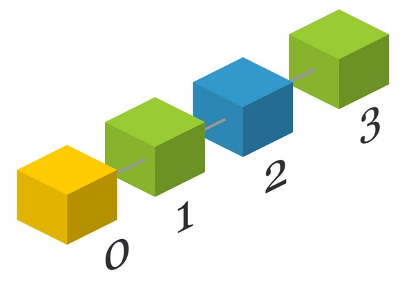
Las listas pueden tener tantos elementos como se necesiten, es decir que se pueden guardar miles de datos. Para acceder al último elemento de la lista se utiliza el índice [-1], el penúltimo con [-2] y así sucesivamente de atrás hacia adelante.

### Actividades:
2. Actividad: Crear una lista llamada estudiantes y guardar en ella los nombres (solo nombres) de los estudiantes del curso. Mostrar por consola los valores guardados.
3. Actividad: Crear una lista llamada mendoza y guardar en ella 5
elementos ambientales que caractericen a nuestra provincia. Imprimir los valores guardados.
4. Actividad básica: Crear una lista llamada tasa, guardar en ella 3 elementos que sean diferentes tipos de datos (int, float y str) y caractericen a una tasa (una de té o café). Imprimir los valores guardados. Modificar elemento de una lista
Así como se puede acceder a cada elemento de una lista también se puede modificar el valor de cada elemento. Para cambiar el valor a un elemento se hace igual que con las variables aprendidas antes, solamente hay que indicar qué elemento se desea modificar accediendo con su índice.
```py
frutas = ['manzana', 'pera', 'kiwi', 'durazno', 'uva', 'naranja']
frutas[0] = 'mandarina'
```
Ahora la lista tendrá guardada en su interior los siguientes datos:
```py
frutas = ['mandarina', 'pera', 'kiwi', 'durazno', 'uva', 'naranja']
```
Los elementos pueden ser modificados por cualquier tipo de dato:
```py
frutas[3] = 1080
```
Quedando:
```py
frutas = ['mandarina', 'pera', 'kiwi', 1080, 'uva', 'naranja']
```
### IMPORTANTE: no confundir el tercer elemento con el elemento en el índice 3 porque el elemento guardado en [3] es el cuarto elemento, recordar y recalcar siempre que el conteo empieza en 0.

Los elementos pueden ser eliminados de las listas mediante el uso del método del.
```py
del frutas[3]
```
Resulta: 
```py
frutas = ['mandarina', 'pera', 'kiwi', 'uva', 'naranja']
```
La lista tiene un elemento menos.
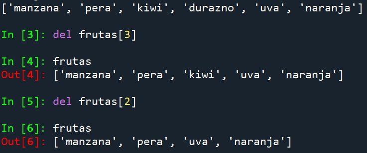
```py
p = [13.55, 13.26, 11.42, 17.0, 15.66]
del p[4]
print(p)
``` 
Resultado en consola 
```py
[13.55, 13.26, 11.42, 17.0]
```
Para conocer la longitud de una lista se utiliza la función len():
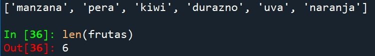
Como las listas pueden contener cualquier tipo de dato en su  anterior, también se pueden guardar listas dentro de las listas. A esto se le llama lista anidada.

5. Actividad: ¿En qué caso se te ocurre que se necesite guardar una lista dentro de otra lista?
Para acceder a los valores de las listas hay que usar los [] con los índices tantas veces como listas anidadas se tengan, uno a continuación del otro.
```py
w = [1.78, ‘2022’, [‘rojo’, ‘amarillo’, [‘verde’, ‘cian’]]]
print(w[2][0]) #’rojo’
print(w[2][1]) #’amarillo’
print(w[2][2][0]) #’verde’
print(w[2][2][1])) #’cian’
```
No iremos tan profundo, pero sepan que esto último es posible y tienen el nombre de matrices.
### Hay que pensar que una lista es una variable más solo que contiene muchos elementos bajo un mismo nombre.
```py
l = [2, 4, 6, 8, 10]
f = l
print (f) #[2, 4, 6, 8, 10]
```
También se pueden crear sublistas a partir de una lista. Para ello se debe colocar entre corchetes el índice de inicio + operador : + índice final, no incluirá el elemento del índice final. 
```py
Sublista = lista[inicio:fin]
f = l[2:4] #(va a imprimir elementos entre el índice 2 y 3)
print(f) #[6,8]
f = l[0:4] #(va a imprimir elementos entre el índice 0 y 3)
print(f) # [2, 4, 6, 8]
```
Existe un operador para unir listas, éste es +=
```py
f = [0, 1, 2]
f += [4, 5] #tambien se puede hacer f= [0, 1, 2] + [4, 5]
print(f) #[0, 1, 2, 4, 5]
```
### Actividades:
6. Actividad: Crear una lista vehiculos a partir de las 3 listas que se presentan a continuación. Indicar la  longitud de cada una de las listas y de la nueva lista. 
## Importante!: No olvidar el uso de Ctrl+C y Ctrl+V
```py
vehiculos_aereos = [‘avion’, ‘globo’, ‘teledirigible’, helicóptero’]

vehiculos_terrestres = [‘auto’, ‘bicicleta’, ‘autobus’, ‘moto’, ‘tren’, ‘cuatriciclo’]

vehiculos_acuaticos = [‘barco’, ‘lancha’, ‘buque’, ‘crucero’, ‘submarino’, ‘velero’]
```
7. Actividad : Crear una lista llamada estudiantes, el primer elemento de la lista será otra lista (anidada) que contenga todos los nombres de al menos 5 estudiantes de tu curso, el segundo elemento de la lista será otra lista que contenga los apellidos de los mismos estudiantes.
Ahora intentá imprimir tu nombre completo haciendo uso de los índices de las listas, recordar que cuando hay una lista dentro de otra lista los índices van a ser más de uno, y estarán uno a continuación del otro.

8. Actividad: Mediante programación eliminar los elementos de la lista que no pertenezcan al grupo 
```py
a. comida = ['tarta', 'palta', 'puré de papa', 'herramienta', 'ensalada', 'pollo', 'celular']

b. colores = ['violeta', 'azul', 'piedra preciosa', 'verde', 'cian', 'mantecado', 'alf']

c. indumentaria = ['yerba mate', 'reloj', 'saco', 'remera', 'mueble', 'música', 'collar', 'vestido']
```

## Métodos de las listas
Todas las listas tienen métodos, que son acciones o funciones que se pueden realizar sobre los objetos listas. Los métodos permiten manipular algunas propiedades de las listas con facilidad.
Los métodos tienen un nombre y una función específica. Hay que seguir el siguiente formato para el uso de métodos nombre_lista.metodo().
Los métodos de las listas son los siguientes:

● .append(valor) : agrega un elemento al final de la lista con el valor colocado entre paréntesis.

● .insert(índice, valor) : agrega un elemento en el índice señalado con el valor indicado en los paréntesis.

● .remove(índice) : elimina el elemento del índice indicado entre paréntesis.

● .extend(lista) : agrega una lista a la lista original (mismo uso que +=).

● .pop() : elimina el último valor de la lista.

● .reverse() : invierte el orden de la lista.

● .sort() ordena los elementos de la lista de menor a mayor.

● .sort(reverse=True): ordena elementos de mayor a menor.

● .index(valor) : busca el valor colocado entre paréntesis en la lista y nos dice en qué índice se encuentra ese valor.
```py
calles = ['San Martín', 'E. Blanco', 'Rioja', 'San Isidro']
calles.pop()
print(calles)
```
Salida:
```py
 ['San Martín', 'E. Blanco', 'Rioja']
```
```py
calles.insert(1,'San Juan')
```
Salida: 
```py
[‘San Martin’, ‘San Juan’, ‘E. Blanco’, ‘Rioja’]
```

### Actividades:
9. Actividad : Usando los métodos de las listas indicar el índice donde se encuentra la palabra ‘celular’ de la siguiente lista:
```py
medio = ['TV', 'Internet', 'celular', 'stories', 'diario', 'revista', 'radio']
```
10. Actividad: Ordenar de menor a mayor la siguiente lista: 
```py
[0, 45, 31, 70, 11, 2, 93, 16, 85, 39, 94, 46, 88, 94, 7, 51, 93, 53, 95, 5, 97, 11, 64, 6, 31, 51, 27, 7, 14, 11, 65, 65, 73, 39, 40, 72, 31, 32, 83, 9, 4, 65, 51, 89, 52, 30, 20, 45, 96, 57, 88, 75, 97, 98, 14, 83, 1, 78, 25, 17, 98, 99, 16, 77, 98, 18, 50, 17, 67, 18, 0, 48, 23, 72, 2, 26, 25, 50, 44, 47, 51, 80, 81, 22, 53, 79, 81, 19, 19, 95, 84, 59, 50, 25, 25, 8, 36, 5, 97, 99, 92]
```
No olvidar el uso de Ctrl+C y Ctrl+V

11. Actividad : Ordenar de mayor a menor la lista anterior.
12. Actividad : Crear un programa que lea por teclado números y los guarde en una lista, el programa pedirá tantos números como se le desee dar, el proceso finaliza cuando el usuario ingresa un número negativo (no se guarda el negativo). Al finalizar mostrar el máximo número introducido, el mínimo y la longitud de la lista.

### ¿Es posible elaborar y analizar nuestras propias listas?
De la misma manera que los elementos de una lista tienen un valor, un formato y permiten clasificar distintos componentes. Los datos con que trabajamos de manera constante pueden ser analizados y clasificados en sus respectivas categorías.
En esta instancia te proponemos comenzar a trabajar sobre los contenidos de habilidades blandas para que al final de esta estación puedan ser integrados en el proceso de análisis con
Python. En muchas ocasiones, se trabaja en bases de datos que son construidas con anterioridad, en esta ocasión les proponemos construir nuestra propia base de datos para identificar e incorporar a la práctica los conceptos aprendidos.


# Conjuntos:
Existe un tipo de dato de Python llamados conjuntos o sets que son muy similares a las listas y comparten muchos aspectos, pero con sus diferencias:

● Los elementos de los conjuntos son únicos, no pueden repetirse o haber duplicados del mismo valor.

● Los conjuntos son desordenados, no mantienen orden en sus índices. Cambian sin avisarnos.

● Se crean entre llaves {} o se puede convertir una lista en conjunto mediante la función set([ ]).

● Los valores de los elementos no son variables. Son inmutables.
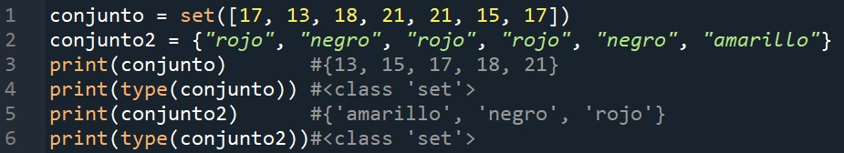

En este curso optaremos la opción de crear conjuntos mediante llaves { }. La función set() sirve para convertir una lista en un conjunto.


No se pueden colocar listas dentro de los conjuntos, ya que las listas son mutables por definición.

Para conocer la longitud de un conjunto se hace uso de la función len(), el resultado que devuelve es un número entero que indica cuántos elementos no repetidos tiene el conjunto.
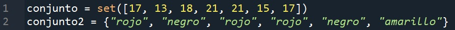
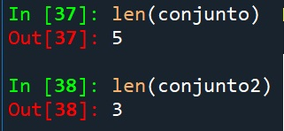

Existe un operador que se usa para saber si está presente un elemento en un conjunto o lista, el operador in. Si el valor existe en el conjunto la respuesta es True, de lo contrario False.
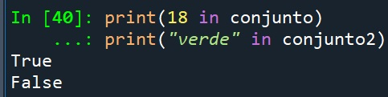

Métodos de los conjuntos:
Todos los conjuntos tienen métodos, que son acciones o funciones que se pueden realizar sobre los objetos conjuntos o sets. Los métodos permiten manipular conjuntos con facilidad.
Recordar que los conjuntos no tienen un orden, el orden no puede ser manejado por el programador como en las listas.

### Los métodos disponibles para los conjuntos son los siguientes:

● .add(valor) : agrega un elemento al conjunto.

● .remove(elemento_que_desea_eliminar) : elimina el elemento especificado del conjunto. Si no lo encuentra en el conjunto devuelve un error.

● .discard(): es un remove() pero solo que si no encuentra el elemento no devuelve error, por obvias razones preferimos este método que no detiene el programa si el elemento no existe.

● .pop() elimina un elemento aleatorio del conjunto.

● .union(conjunto) une dos conjuntos.

● .intersection() genera una colección con los elementos compartidos en ambos conjuntos.

*existen más, solo hemos colocado los más representativos.

### Actividades :
13. A modo de repaso, discutir las semejanzas y diferencias existentes entre listas y conjuntos.

14. Realizar un programa que guarde en un conjunto tantos nombres como el usuario quiera, si se introduce una ‘f’ el programa deja de solicitar nombres para el conjunto.
Intentar introducir dos nombres iguales, intentar introducir dos nombres similares cambiando las mayúsculas o con/sin acento. Verificar si se guardan ambos datos.

## Bucle for: repetir hasta que……
Otra estructura de control es la del bucle for, es un bucle que se repetirá la cantidad de veces que le indiquemos, a diferencia del while que se repite una cantidad de veces indefinidas. Una vuelta de bucle (o repetición) la llamamos iteración.

El uso de for en Python está anexado al uso de la función range() ya que facilita mucho la iteración y control de la secuencia del bucle for. Por eso en esta sección estudiaremos ambos
conceptos juntos.

### Función Range:

La función range() es un tipo de dato de Python que se utiliza para generar una secuencia de números. La función range() devuelve una secuencia de números, comenzando desde 0 de
forma predeterminada e incrementa en 1 (de forma predeterminada) y se detiene antes del número especificado entre los paréntesis de la función.

Sintaxis de range():

range(inicio, fin-1, paso)

● Inicio: número inicial de la secuencia

● Fin: número final de la secuencia menos uno.

● Paso: incremento entre paso y paso de la secuencia.

for var in range()

Mediante los siguientes ejemplos se comprenderán mejor los conceptos explicados anteriormente, para ello se solicita ejecutar algunas de las siguientes porciones de código y
armar una oración que explique el comportamiento:


Código: 

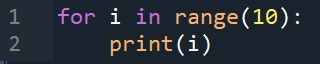
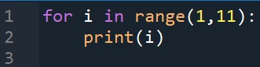
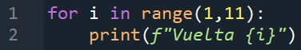
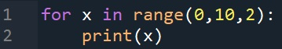
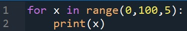
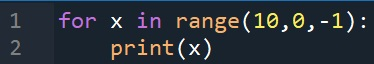
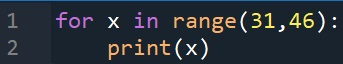

Resultado:

El bucle for es un bucle repetidor, va a repetir tantas veces como range sea configurado, dependiendo del valor de inicio, el fin y el paso elegido para range. El bucle for se utiliza para
repetir una acción una cantidad limitada de veces, a diferencia del while que la cantidad de veces que se repite no siempre es la misma o es incierta (depende de la condición).
### Actividades:
15. Actividad : Generar un programa que el resultado sea imprimir una cuenta ascendente desde 40 a 85.

16.Actividad : Imprimir los elementos de esta lista vehiculos, uno abajo del otro mediante el uso del for. Recordar y asociar el uso de la función len(), que devuelve la cantidad de elementos de la lista.
```py
vehiculos=[‘avión’,’bicicleta’,’coche’,’motocicleta’,’tractor’,’barco’,’transatlántico’,’camión’]
```

17.Actividad : Copiar el siguiente programa y junto con la ayuda de tus compañeros comentar el funcionamiento. Probar distintos métodos para lograr entenderlo, se pueden imprimir las iteraciones del for para ver cómo avanza el programa, verificar que se conozcan todos los operadores usados en el código. ¿Qué
caracteriza a un número primo? ¿Tiene sentido con las condiciones impuestas en el código? ¿Qué es un contador? ¿Para qué se usa en este caso?
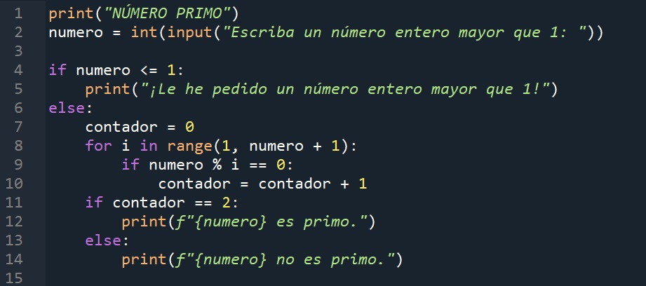

18. Actividad : Escribir un programa que pida ingresar dos números
enteros positivos, ‘Escriba un número entero positivo’, ‘Escriba un número entero  mayor que (número anterior)’. La salida del programa tiene que ser la suma de todos los números enteros desde el primero hasta el segundo. Guiarse con los siguientes ejemplos de ejecución:
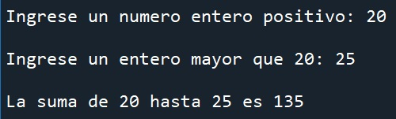 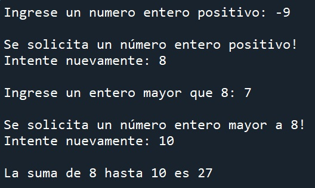

19. Actividad : Escribir un programa que al inicio pregunte cuántos nuevos nombres de usuario se ingresarán. Si el número es 0, el mensaje es ‘Hasta la vista’. Si el número es negativo la respuesta será ‘Imposible’. Si el número es un entero positivo
pida tantos nombre como indica el número y los guarde en una misma lista llamada nombres_usuarios (se recomienda el uso de métodos de listas). Al finalizar debe imprimir un mensaje mostrando el contenido de la lista.

20. Actividad : Realizar un programa que solicite un nombre y a
continuación lo busque en un conjunto, si está en el conjunto lo copia en una lista. Si no está, anuncia: “Nombre no encontrado”. En la lista se guardarán todos los nombres compatibles y se imprimirá un anuncio que diga “Nombre encontrado. Guardado en
lista de nombres.”. El programa deberá ejecutarse hasta que se ingrese la letra ‘f’ minúscula, finalizando e imprimiendo la cantidad de nombres encontrados.

21. Actividad : Escribir un programa que solicite 5 notas de un estudiante, las guarde en una lista y al finalizar muestra la nota más alta, la más baja y el promedio de todas las notas.
Promedio = (suma de las 5 notas)/5

22. Actividad : Escribir un programa que devuelva ‘True’ si hay dos o más elementos iguales en una lista de las que hemos generado con anterioridad. Podés usar el ejercicio de nombre y apellido de los alumnos para verificar si hay dos chicos que se
llamen igual.

23. Actividad : Modificar el programa anterior para que pregunte si se desea eliminar las copias de los elementos iguales. Al ingresar ‘Si’, que elimine los elementos que están más de una vez.
24. Actividad complementaria: Escribir un programa que solicite guardar 5 palabras en una lista. Una vez ingresados, copia los elementos en otra lista pero los guarda en orden inverso. Luego imprime los elementos de ambas listas para verificar el resultado.

25. Actividad : Realiza un programa donde se introduzca el nombre y la edad de cada alumno (pensar en cómo gestionar esa información, sin en una sola lista o en dos, por ejemplo). El proceso de lectura de datos terminará cuando se introduzca como nombre un asterisco (*) Al finalizar se mostrará los siguientes datos:

    a. Los estudiantes mayores de 16.

    b. Los 3 estudiantes más grandes del curso.

26. Actividad : Se desea crear un programa en el que se pueda buscar un nombre en una lista. Si el nombre no existe dirá: “Esa persona no está en el sistema”, si el nombre existe deberá responder con las características de esa persona.

    Utilizar la siguiente lista: empleados_2023 = [['Milton', 1.76, 'Lavalle'], ['Nely', 1.61, 'Godoy Cruz'],['Jairo', 1.71,'Luján de Cuyo'],['Emma', 1.64,'San Rafael'],['Martina', 1.59,'San Carlos']] o utilizar las listas creadas para el curso.

27. Actividad: Crear un programa que imprima un menú de opciones que tenga la capacidad de realizar acciones en loop, cada texto o número que se guarda lo hace en dos listas separadas.
El menú será el siguiente:

    a. Introducir un texto:

    b. Introducir un número:

    c. Imprimir lista de texto:

    d. Imprimir lista de números:

    e. Salir del programa.


