***Fernando Del Pozzi - Mendoza Futura 2023***
[GitHub Episodio 2](https://github.com/fernandoDelPo/mendoza-futura/tree/main/Episodio%202)
# ESTACION 3 

## Tema 3.1- Formato programa básico Python
Existen dos plantillas o formatos básicos para programar con Python:

    ● Sin función “main()” (sin funciones)
    ● Con función “main()”

La palabra “main” significa “principal”, se suele utilizar esta función para ejecutar programas grandes de forma ordenada. No es necesario que siempre esté esta función, pero se recomienda su uso como una buena práctica de la programación.
El siguiente ejemplo se muestra un programa de Python básico con el uso de la función principal o “main()”

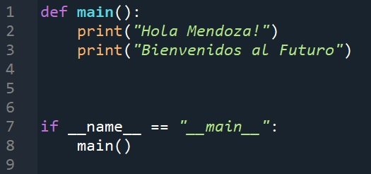

*Ilustración 1. El programa ejecuta lo que está dentro de "def main()"*

Es importante que las instrucciones colocadas dentro de la función main() contengan la “indentación”, “tabulación” o sangría, de lo contrario el programa no funcionará correctamente.

Los programas de Python no necesitan realmente la función main(), por lo que lo siguientes programas presentan el mismo resultado:

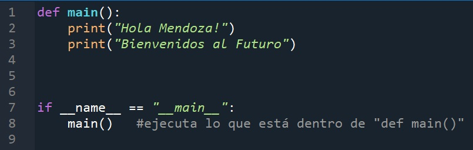
*Ilustración 2. Con función main()*

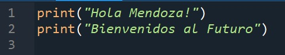

*Ilustración 3. Sin función main()*

Pero para el uso de ciertas bibliotecas, es importante aprender a utilizarlo.
### Configuración Spyder para utilizar Python con función main()

A partir de esta sección se usará el siguiente código base para realizar cualquier programa:

A continuación, se configurará Spyder para que cada vez que se cree un archivo nuevo (Ctrl+N) aparezca la porción de código mostrado en la imagen anterior:

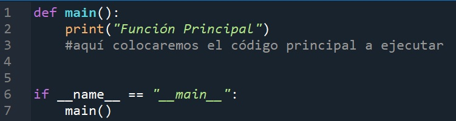

Ir a herramientas >> Preferencias

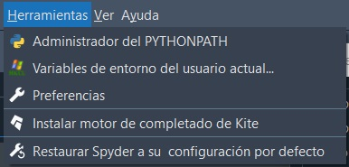

En preferencias ir a Editor (última sección) y tocar en el botón “Editar la plantilla para nuevos archivos”:

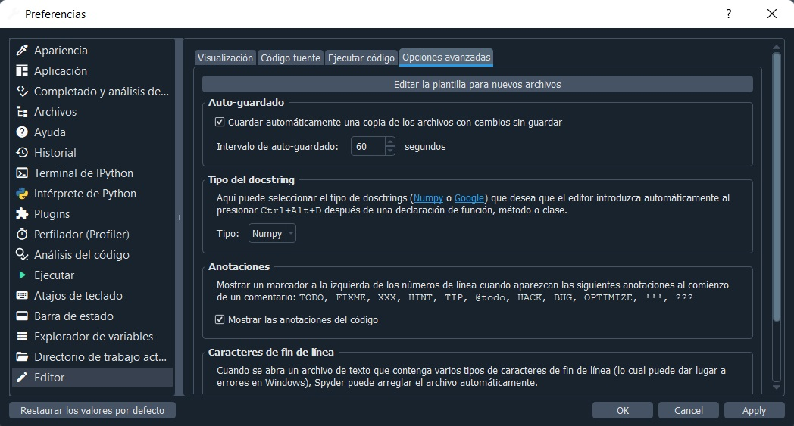

Al clickear sobre “Editar la plantilla para nuevos archivos” en el editor de Python de Spyder se abrirá un archivo llamado template.py que tiene escrito el siguiente texto:

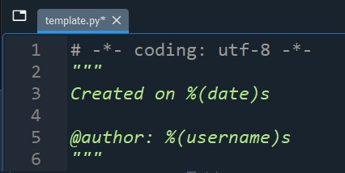

Modificaremos este archivo copiando y pegando la siguiente porción de código:
```js
def main():
    # Acá ponemos todo el código o lógica de de las 
    # instrucciones de la funcion
if __name__ == "__main__":
    main()

    # de ahora en más colocaremos en esta sección el código a # ejecutar
    #no olvidar indentación o tabulación.
```

Una vez pegado el código se guarda la plantilla. Ahora abrir un nuevo archivo (Ctrl+N) observar si los cambios fueron efectuados.
Crear una función main() y probar el siguiente código:


NO OLVIDAR NUNCA LA INDENTACIÓN O TABULACIÓN, ya que marca jerarquía de código e indica qué parte del código pertenece a una función o estructura de control.

### Funciones personalizadas en Python
Las funciones son porciones de código que hacen una tarea específica, sirven para minimizar el código, hacer más estética la resolución del problema y para sistematizar en bloques el problema a resolver. Se pueden comparar con la función “Mis Bloques” de mBlock.

En este curso se han utilizado funciones de Python, se caracterizan por tener un nombre y paréntesis al final. El nombre es tal que indica la función que realiza esta función (valga la redundancia), por ejemplo: print().

## Funciones python

Aquí tienes una lista de 30 funciones importantes en Python:

1- **print()**: Imprime texto o variables en la salida estándar.

2- **len()**: Obtiene la longitud de una secuencia.

3- **input()**: Recibe la entrada del usuario desde el teclado.

4- **range()**: Genera una secuencia de números.

5- **open()**: Abre un archivo en modo de lectura, escritura o ambos.

6- **type()**: Devuelve el tipo de datos de un objeto.

7- **str()**: Convierte un objeto en una cadena de caracteres.

8- **int()**: Convierte un objeto en un número entero.

9- **float()**: Convierte un objeto en un número de punto flotante.

10- **list()**: Crea una lista a partir de un objeto iterable.

11- **tuple()**: Crea una tupla a partir de un objeto iterable.

12- **dict()**: Crea un diccionario.

13- **set()**: Crea un conjunto.

14- **sum()**: Calcula la suma de los elementos en una secuencia numérica.

15- **sorted()**: Ordena los elementos de una secuencia.

16- **zip():** Combina dos o más secuencias en una secuencia de tuplas emparejadas.

17- **max()**: Devuelve el valor máximo de una secuencia.

18- **min()**: Devuelve el valor mínimo de una secuencia.

19- **abs()**: Devuelve el valor absoluto de un número.

20- **round()**: Redondea un número al entero más cercano.

21- **all()**: Verifica si todos los elementos en una secuencia son verdaderos.

22- **any()**: Verifica si al menos uno de los elementos en una secuencia es verdadero.

23- **map()**: Aplica una función a cada elemento de una secuencia.

24- **filter()**: Filtra una secuencia según una función de prueba.

25- **lambda()**: Define funciones anónimas (funciones sin nombre).

26- **enumerate()**: Devuelve un objeto enumerado que contiene pares de índices y elementos de una secuencia.

27- **chr()**: Devuelve una cadena que representa un carácter Unicode.

28- **ord()**: Devuelve el valor entero que representa un carácter Unicode.

29- **dir()**: Devuelve una lista de nombres en el espacio de nombres actual o de un objeto.

30- **help()**: Proporciona información de ayuda interactiva sobre objetos y módulos.


Estas son solo algunas de las funciones importantes en Python, pero hay muchas más disponibles en la biblioteca estándar y en módulos externos que pueden adaptarse a diversas necesidades de programación.


En cualquier lenguaje de programación existen las funciones, lo interesante está en que se pueden crear funciones personalizadas, es decir, cada programador puede realizar sus propias funciones y luego aplicarlas sin necesidad de escribir nuevamente todo el código.
La idea es dividir el programa en pequeños segmentos para realizar tareas concretas. Estas funciones sirven para realizar tareas que sean repetitivas y ahorrar en escribir el código varias veces, también son usadas para “embellecer” la parte visible del código.
Se puede acceder (llamar) a una determinada función desde cualquier parte de un programa.
Cuando se llama a una función, se ejecutan las instrucciones que constituyen dicha función.

Una vez que se ejecutan las instrucciones de la función, se devuelve el control del programa a la siguiente instrucción (si existe) inmediatamente después de la que provocó la llamada a la función.

La dinámica de funciones se maneja de la siguiente manera:

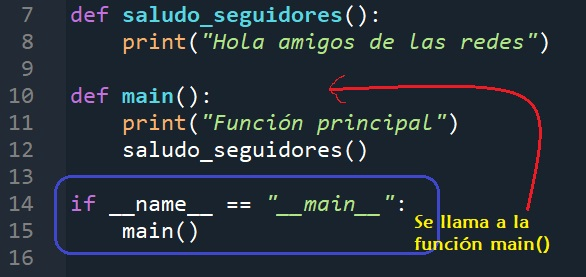
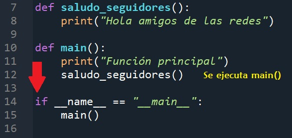
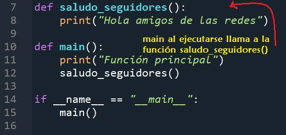
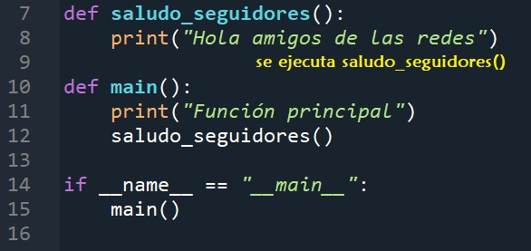


Resultado:

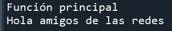

**Características de las funciones:**

Las funciones se “llaman” cuando se desean usar.
Las funciones tienen argumentos.
Las funciones cumplen una tarea específica.
Las funciones “devuelven” un valor que tiene un tipo de dato definido (tipo de retorno) con el
“return”.

### Sentencia def
La sentencia def es una definición de función usada para crear  bjetos funciones definidas por el usuario.

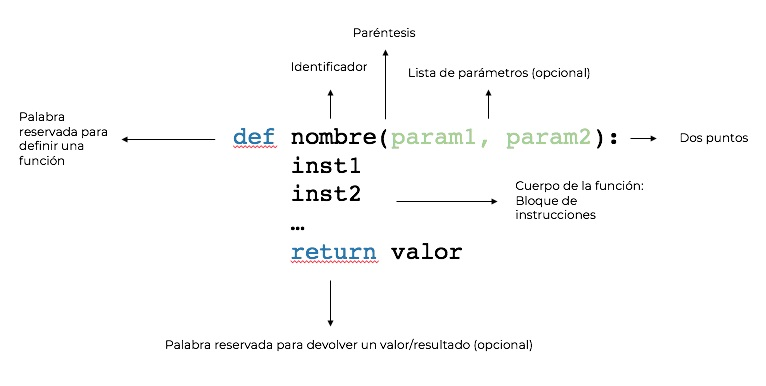

Para definir una función en Python se utiliza la palabra reservada def. Luego viene el nombre de la función que es usado para llamarla o invocarla. Después del nombre se colocan los paréntesis, dentro de los paréntesis los argumentos o parámetros y finaliza con los dos puntos :

No debe olvidarse que instrucciones de la función van indentadas.
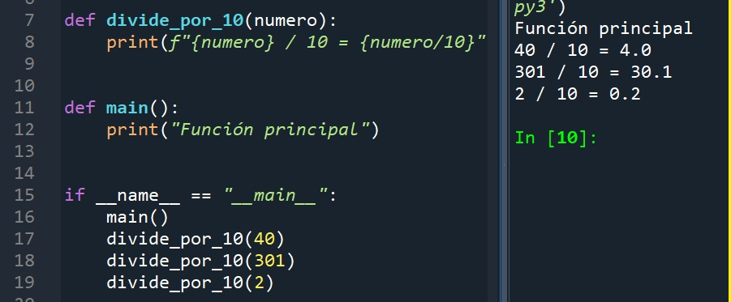

La función divide_por_10(numero) cumple la función de dividir por 10 el número ingresado. Al crear la función se hace de forma genérica, en donde numero no tiene un valor numérico, es un parámetro. Al hacer uso de la función se le da un valor al parámetro para que sea reemplazado en el “esqueleto” genérico de la función y opere con el proceso que realiza esta función.

### Sentencia return
La sentencia return hace que la función termine la ejecución, haciendo que el programa continúe por su flujo normal.
La sentencia return también se usa para devolver un resultado o un valor.
Observar los siguientes ejemplos:


Return para finalizar una función:


Return para devolver valores (resultados):

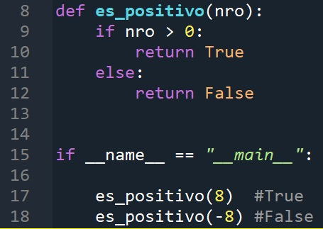
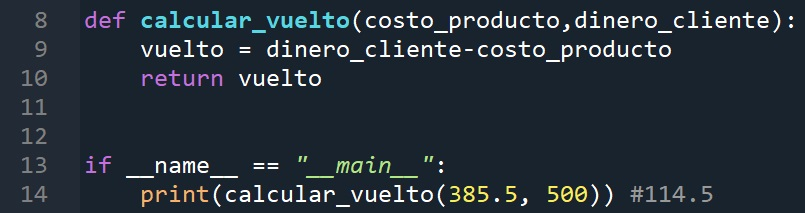

Como se observa, cada función devuelve un valor o imprime un mensaje. Al retornar un valor hay dos opciones: se pueden guardar en otra variable o se puede imprimir.

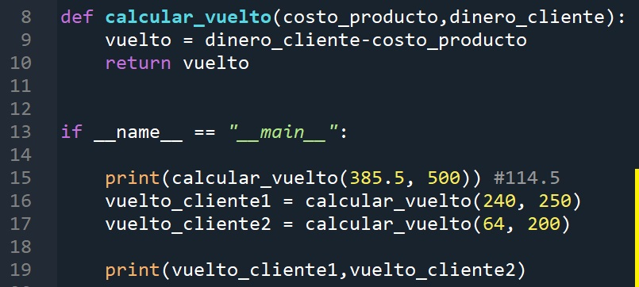

La idea de las funciones es evitar hacer el código de cálculos o tareas repetitivas más de una vez. Las funciones se crean para ahorrar tiempo espacio y optimizar el código.


**Actividades**
2. Actividad básica: Crear una función llamada suma() que sume dos
números. Como resultado imprime “La suma de {numero1} y {numero2} es
{resultado}”

3. Actividad complementaria:Crear una función llamada triangulo_equilatero(base, altura). Recibe como entradas la base y la altura del triángulo. Como resultado expresará: lado del triangulo (base), altura del triángulo (ojo acá!), perímetro del triángulo (base+base+base), área del triángulo (b*h/2).

4. Actividad básica: Modificar el programa de las estaciones haciendo una función llamada estacion(día,mes), la salida es la estación de ese día y mes.
Crear un programa que solicite el mes y el día actual. La respuesta del programa deberá ser la estación correspondiente al día y mes ingresado . Por ejemplo, si el día es 28 y el mes 3, la respuesta será “Es otoño”. Ayuda: es necesario usar los operadores lógicos y lo operadores de comparación. Considerar la siguiente información y adoptar una estrategia para resolver el problema.
```sh
    a. Equinoccio de marzo: día 20 COMIENZA EL OTOÑO
    b. Solsticio de junio: día 21 COMIENZA EL INVIERNO
    c. Equinoccio de septiembre: día 21 COMIENZA PRIMAVERA
    d. Solsticio de diciembre: día 21 COMIENZA EL VERANO
```
5. Actividad complementaria:

  Crear una función con el siguiente código:

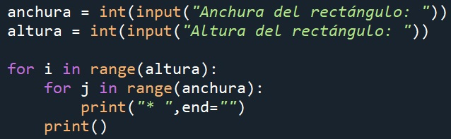

Discusión ¿Qué hace el código? Pensar cómo llamar la función, cuáles serán sus parámetros y cuál será el resultado.

6. Actividad básica: Elige el programa realizado en las secciones anteriores que más te guste y transfórmalo en una función.

7. Actividad básica: Crea un programa que pida dos números enteros al usuario y diga si alguno de ellos es múltiplo del otro. Crea una función es_multiplo() que reciba los dos números, y devuelve si el primero es múltiplo del segundo. (Uso de %)

8. Actividad básica:En un mismo programa, colocar 3 de las funciones realizadas
anteriormente y hacer llamadas a cada una de ellas en la función principal (if
__name__ == “__main__”: )


# Tema 3.3- Bibliotecas
## Instalar bibliotecas y uso de import
Una biblioteca es uno o varios archivos escritos en Python que proporcionan diversas funcionalidades. Cada biblioteca se especializa en un tema en específico.
Es un conjunto de funciones especializadas en hacer determinada tarea. Por ejemplo, existe la librería Numpy (Numeric Python) especializada en manejo de gran cantidad de datos numéricos, Matplotlib que genera gráficos en Python, Pygame que tiene funciones para crear videojuegos, y muchas más.

#DATAZO: Suelen llamarse bibliotecas o librerías, vienen del inglés “library” que si lo traducimos es biblioteca, pero como “suena” a librería en la jerga se le dice de ambas maneras. Una librería es el lugar donde venden libros (bookstore), una biblioteca en cambio es un lugar en donde se recopila información de forma ordenada (library).
En Spyder contamos con bibliotecas instaladas por defecto, comenzaremos con el uso de una de ellas, que tal vez ya conozcan o hayan escuchado nombrar:

### Biblioteca Random
La biblioteca random contiene una serie de funciones relacionadas con los valores aleatorios.
Existen diversas aplicaciones que como programadores se necesita hacer pruebas con números aleatorios para probar el desempeño de los programas o simplemente para no tener que estar pensando en un número y que el programa cree un número cualquiera para ejecutar el programa.
Para poder usar la biblioteca hay que importarla. Importar una biblioteca significa que se añaden una serie de códigos (que no se ven) al programa, para hacer uso de las funciones que hay en esta. Básicamente es usar un código que resuelve un problema específico, la ventaja es que no hay que pensar de más y se tiene la solución a disposición del programador.

Colocaremos en las primeras líneas de código:

```py
import random
```
Podríamos importar la biblioteca en cualquier lugar, siempre y cuando sea antes de necesitar usarla, pero es recomendable importar todas las bibliotecas que vayamos a utilizar en las primeras líneas de código, de forma de tenerlas a la vista, no repetir y que no nos falten.

**Esta biblioteca contiene las funciones:**

random.randrange(N) ---------Devuelve un número ENTERO entre 0 y N

random.randint(a, b) ---------- Devuelve un número ENTERO entre a y b

random.random() --------------Devuelve un número DECIMAL entre 0 y 1

random.uniform(a, b) ----------Devuelve un número DECIMAL entre a y b

random.choice(["uno", "dos", "tres"]) ---------Devuelve un valor aleatorio de la lista
random.choice("AEIOU")


9. Actividad básica: Con un bucle for, llenar una lista con 100 números enteros aleatorios que pueden ir del 0 al 1000.
10.Actividad complementaria: Elegir una palabra aleatoria de la siguiente lista:

```py
vehiculos=[‘avión’,’bicicleta’,’coche’,’motocicleta’,’tractor’,’barco’,’transatlántico’,’camión’]
```

### ¿Cómo instalar una biblioteca en Spyder?
Para poder hacer uso de una biblioteca, primero hay que instalarla en nuestro sistema.
El software Spyder tiene incluidas algunas de estas librerías, como Numpy y Matplotlib. Pero si se desea utilizar otras librerías menos conocidas, se deben instalar. Se explicará su instalación a
través de un ejemplo práctico.
Consigna: Hacer un juego básico con Python.


Primero, se implementa el siguiente código, sacado como ejemplo de esta página web:

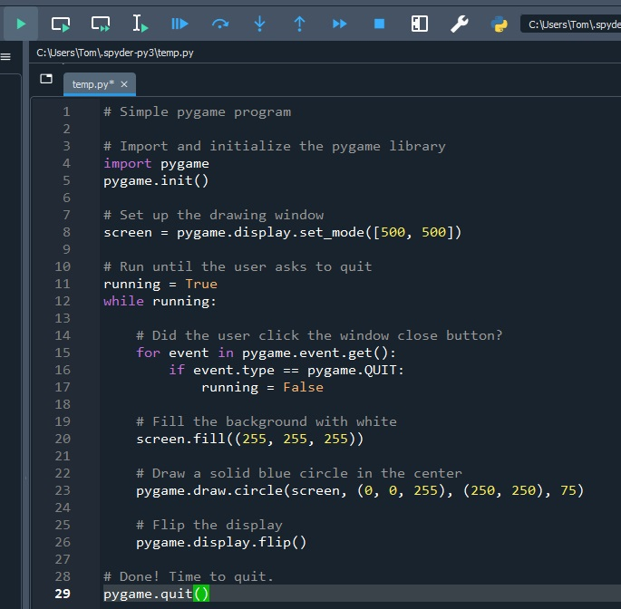

Obsérvese que la primer instrucción es import pygame. Sirve para indicarle a Python que utilizaremos la librería pygame en este programa.

Se presiona el botón verde (Play) para correr el archivo, y en la consola de la derecha se puede ver un mensaje que dice que no existe ningún módulo llamado pygame 

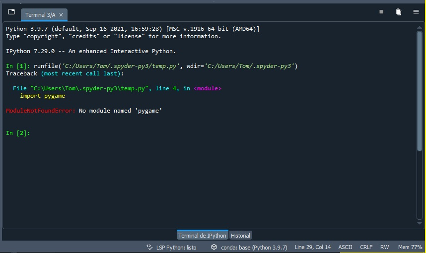

Esto es porque no hemos instalado la librería pygame.


Se procede a instalar escribiendo en la consola !pip install pygame y presionando enter.

```py
!pip install pygame
```

Luego de unos segundos, aparecerá un mensaje que indica que la librería fue correctamente instalada.

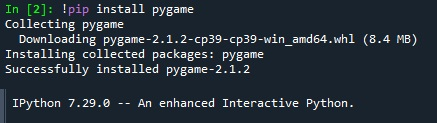

Si se corre el programa nuevamente, arrojará lo siguiente en la consola:

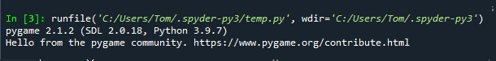

y se abrirá la siguiente ventana:

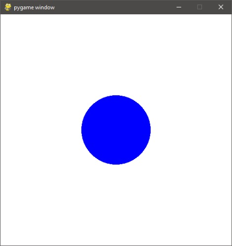

Por ahora no se puede interactuar con esta ventana, pero, ¡Vamos de a poco!
Cabe destacar que suelen haber errores en los usos de bibliotecas, hay PC que las reconocen bien en su primer uso pero que no te extrañe que algo pueda salir mal! Si aparece un error lo mejor que se puede hacer es copiar el error y buscarlo en internet. Las páginas que suelen brindar las mejores soluciones son: StackOverflow, Reddit, tutoriales en Youtube, entre otras.

A veces será suficiente guardar los cambios, reiniciar Spyder y volver a intentarlo.

### Matplotlib

Matplotlib es una biblioteca completa para crear visualizaciones estáticas, animadas e interactivas en Python. Suele usarse junto a la librería de Numpy para aprovecharla al máximo.

```py
from matplotlib import pyplot as plt
```
Matplotlib nos permite generar gráficos de barras, de puntos, de torta, etc.

https://matplotlib.org/stable/gallery/index.html

Para generar un gráfico de puntos:

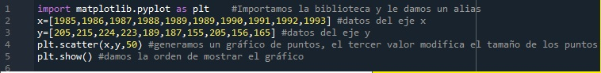

Para generar un gráfico de barras:

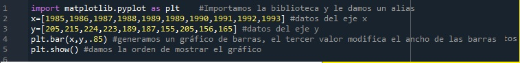

Para generar un gráfico de torta:

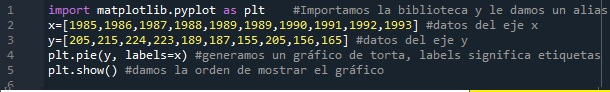

### Numpy

Numpy es un paquete científico que contiene herramientas de computación numérica, vectores y matrices, funciones matemáticas, generadores de números aleatorios, etc.
```py
import numpy as np
```
Para usar numpy y matplotlib suelen mirarse los ejemplos de las páginas oficiales de estas librerías, así como la documentación, a continuación, se dejan algunos ejemplos para observar el uso de las librerías

```py
from matplotlib import pyplot as plt
import numpy as np
señal = np.random(100, size=[30])
plt.plot(señal)
```
```py
import numpy as np
from matplotlib import pyplot as plt
x = np.linspace( 0, 90, 90/0.05 ) #linspace(desde, hasta,
cantidad_de_pasos)
y = np.sin(x)
plt.title("Matplotlib demo")
plt.xlabel("Eje X")
plt.ylabel("Eje Y")
plt.plot(x,y)
plt.show()
```
```py
import matplotlib.pyplot as plt
from matplotlib import colors
import numpy as np
datos = np.random.rand(10, 10) * 20 #generamos datis
random
# creamos un mapa de colores
mapCol = colors.ListedColormap(['red', 'black',
'green','yellow'])
limites = [0,10,20]
fig, ax = plt.subplots()
ax.imshow(datos, mapCol)
plt.show()
```


### Turtle

“Turtle” es una librería característica de Python, es como un tablero de dibujo que nos permite ordenarle a una tortuga que dibuje sobre ella. La tortuga es la que dibuja sobre el lienzo que es la pantalla.

```py
#hexagono
import turtle
ventana = turtle.Screen()
ventana.bgcolor("light green") #color de fondo
ventana.title("Mi ventana") #titulo
skk = turtle.Turtle()
#skk.forward(100) #se mueve 100 adelante
for i in range(6):
skk.forward(60)
skk.right(60)
turtle.done()
```
```py
#Arcoiris
import turtle
colors = ['red', 'purple', 'blue', 'green', 'orange', 'yellow']
t = turtle.Pen() #lapiz turtle
turtle.bgcolor('black')
for x in range(360):
t.pencolor(colors[x%6])
t.width(x/100 + 1)
t.forward(x)
t.left(59)
```
```py
#cambio de colores
from turtle import *
setup(450, 200, 0, 0)
screensize(300, 150)
colormode(255)
pencolor(255, 0, 0)
goto(100, 50)
pencolor(0, 255, 0)
goto(100, -50)
pencolor(0, 0, 255)
goto(50, -50)
```

### Códigos en la Web

La idea de esta sección es incentivarlos a investigar en la web las distintas soluciones, respuestas, alternativas y librerías disponibles para poder realizar un programa. Muchas veces nos veremos en la necesidad de solucionar un problema que no sabemos cómo encararlo, por eso es importante poder leer el código y entenderlo. Muchas veces ahí está la respuesta.

https://unipython.com/juego-python-ahorcado/ (el ahorcado)

https://gist.github.com/astrojuanlu/4025886 (Juego de la vida segundo código corregido)

https://gist.github.com/aleramirezsj/5661361 (TaTeTi)


## Tema 3.5- Interfaz Gráfica

### Librería Tkinter

Tkinter es una librería GUI (Interfaz Gráfica de Usuario), del lenguaje de programación Python y funciona para la creación y desarrollo de aplicaciones de escritorio con interfaz gráfica.

En Python tienes varias alternativas para programar una interfaz gráfica de usuario (GUI) pero Tkinter es una buena opción por las siguientes razones:

    ● Es fácil de aprender.

    ● Utiliza muy poco código para crear una aplicación de escritorio funcional.

    ● Diseño en capas.

    ● Portátil en todos los sistemas operativos, incluidos Windows, macOS y Linux.

    ● Preinstalado con la biblioteca estándar de Python.

Comenzaremos a aprender a aplicarla programando:

Creamos una ventana
```py
import tkinter as tk # Importamos el módulo del tema de tkinter
ventana = tk.Tk() # Creamos un objeto usando la clase Tk
ventana.mainloop() # Método que mantiene visible a la ventana, si te olvidas de colocarlo la ventana no se mostrará. Por lo general va al final del código.
```
Con estas tres simples líneas hemos creado la primera ventana, luego aprenderemos a modificarla.
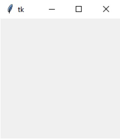


### Widgets de Tkinter

Tkinter proporciona varios controles, como botones, etiquetas y cuadros de texto utilizados en
una aplicación GUI. Estos controles se denominan comúnmente widgets.
Hay que tener en cuenta que tk es un módulo con widgets estándar, en cambio ttk es su
versión actualizada y tiene predefinidos nuevos temas. Esta diferencia se puede notar cuando
creamos botones con un módulo u otro. Es por ello que se recomienda importar ambos
módulos y luego decidir en qué caso usar tk o ttk. Más información:
https://www.pythontutorial.net/tkinter/tkinter-ttk/
Veamos algunos comandos que se usan habitualmente con Tkinter:

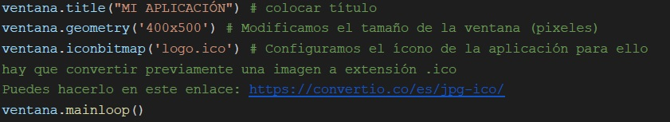

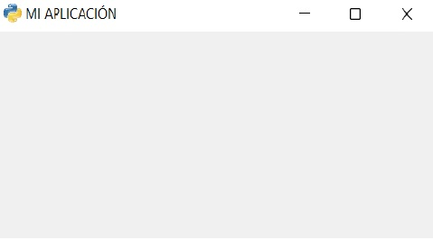

Etiqueta(Label), caja de ingreso (Entry) y botones(Button):

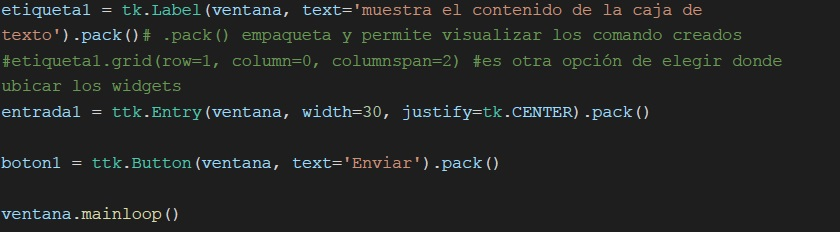

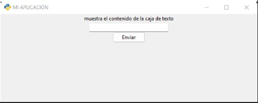

### Módulo para imágenes

Podemos instalar un módulo que no está integrado en Python llamado «Pillow», el cual permite procesar mejor las imágenes y tiene muchos métodos para trabajar con ellas.

Para instalar Pillow vamos a poner en la Terminal lo siguiente:

```py
!pip install Pillow
```

Si aparece «Successfully installed Pillow» o un «Requirement already satisfied» , quiere decir que se ha instalado correctamente.

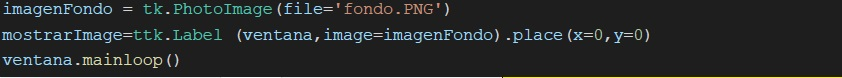

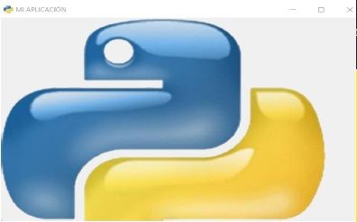

A Continuación un ejemplo, a fin de ver a la herramienta en desarrollo:

** Actividad básica: **
Esta actividad lleva tiempo! Engloba gran parte de todo lo aprendido en Python hasta el momento “Descuento de un restaurante”

Un restaurante ofrece un descuento del 10% si el consumo es mayor a $2000 y paga con tarjeta de crédito NARANJA, un 20% de descuento si paga con tarjeta de crédito Nativa y si es en efectivo tiene un 30% de descuento.

Si el consumo es hasta $2000 no abarca ningún descuento.

Realizar un programa que determine el monto del descuento, y el importe a pagar.


SOLUCIÓN

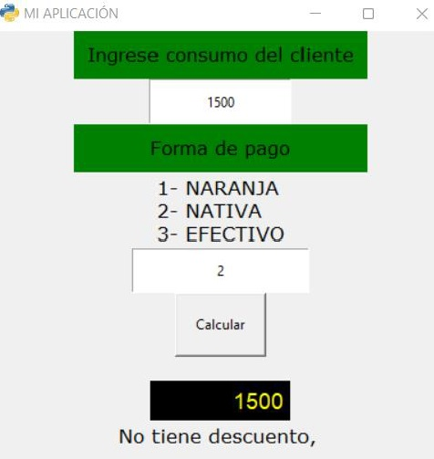

CÓDIGO FUENTE

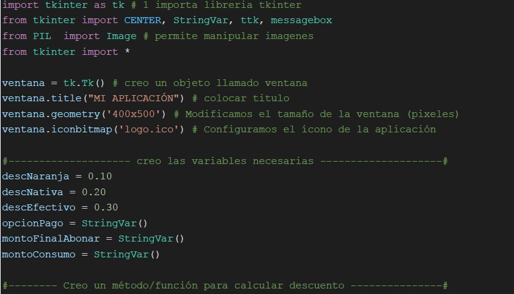

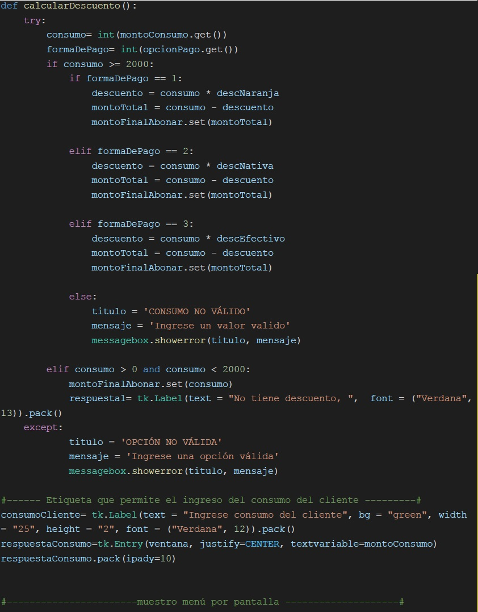

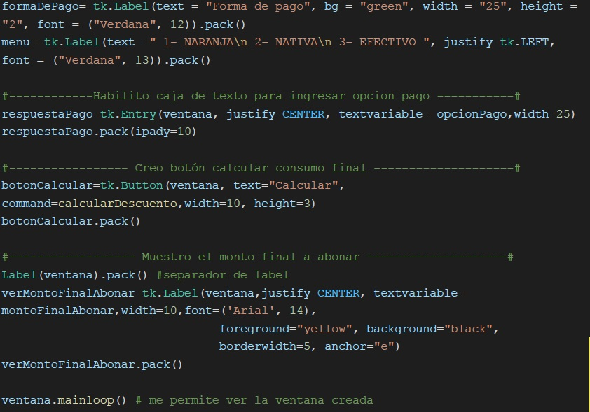


Con este ejemplo vemos lo mínimo para trabajar con este recurso. Es importante el acompañamiento de las habilidades blandas, recalcando que la investigación por parte de los estudiantes puede ofrecer resultados muy interesantes, así como el manejo de otras bibliotecas y recursos.

Para finalizar compartimos enlaces super interesantes sobre esta librería: 
https://www.pythontutorial.net/tkinter/

https://python-para-impacientes.blogspot.com/p/tutorial-de-tkinter.html

https://www.tutorialspoint.com/python/python_gui_programming.htm

https://www.javatpoint.com/python-tkinter-canvas


***Fernando Del Pozzi - Mendoza Futura 2023***
[GitHub Episodio 2](https://github.com/fernandoDelPo/mendoza-futura/tree/main/Episodio%202)